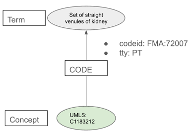

# JSON Knowledge Graph (JKG)
**JSON Knowledge Graph (JKG)** is a specification for a format with which to import into or export information from
a knowledge graph--specifically, a property graph.

# Features of JKG

## Platform-independence
JKG specifies the entities (nodes), edges (rels), and properties of a knowledge graph. 
JKG makes no assumptions about the platform of the graph database that hosts the knowledge graph.

Various repositories such as [jkg-neo4j](https://github.com/x-atlas-consortia/jkg-neo4j/tree/main) support application architectures that support an implementation of JKG 
on a neo4j platform; however, it should be possible to use the actual JKG specification on
other platforms.

## Validation
It is possible to validate a JSON file against the JKG schema. If a JKG JSON
files passes validation tests, it should be possible to import data from the JKG JSON into a graph database 
without issues such as referential integrity.

The jkg-neo repository includes an [application](https://github.com/x-atlas-consortia/jkg-neo4j/blob/main/scripts/README.md#validate_jkg_json) (**validate_jkg_json**) that validates a JKG JSON file against
the JKG Schema. 

# JKG model

A JKG JSON that comforms to the JKG Schema consists of two 
arrays:
* a **nodes** array of _node objects_
* a **rels** array of relationship objects (_rel objects_)

Although JKG can model a knowledge graph, it actually represents one of 
its fundamental entities as a relationship with properties.

## Entities
The entities of the JKG model are:
### Concept
A _concept_ is a discrete codification of an idea--or,
as the [UMLS Reference Manual](https://www.ncbi.nlm.nih.gov/books/NBK9684/) 
describes it, a "meaning".

For example, the UMLS defines a concept UMLS:C1183212 for `Set of straight venules of kidney`.

### Code
A _code_ is a representation of a concept in a vocabulary.
For example, the Foundational Model of Anatomy Ontology (FMA) represents
the concept **UMLS:C1183212** with the code **FMA:72007**; Uberon, on the 
other hand, represents the same concept with the code **UBERON:0010181**.

As described in _Relationships_ below, a code is not represented as a node, but
by properties of a relationship.

### Term
A _term_ is a "lexical variant" of a descriptor for either a concept or code.
For example, UBERON:0010181 can be described as "straight venules of kidney";
"venulae rectae"; "venula rectae renis"; etc.

## Relationships
There two types of relationships in the JKG model:

### concept-term (CODE)
Relationships of this type (also known as _coderels_ in JKG) link
a concept with a code (a representation of the concept in a source).

Although a code is an entity in JKG, it is not represented with a node;
instead, it is represented as a set of properties of a CODE relationship between
a concept entity and one of the code's term entities.



### concept-concept

Relationships between concepts correspond to the common understanding of "relationship"
(or _predicate_) in an ontology assertion. For example, the concept linked to the code for UBERON:0010181 has a _isa_ 
relationship with the concept linked to the code for UBERON:0006544.

# JKG objects

# node objects

There are two basic types of node objects:
* _Entity node objects_ correspond directly to entities in the JKG model.
* _Reference node objects_ correspond to information used to specify entity node objects.


## Source
A **Source** node is a reference node object that describes a _source_ of encoded data used to populate a JKG JSON.
Types of sources include:
* ontologies (e.g., OWL files)
* vocabularies, such as those maintained in the National Library of Medicine's [UMLS](https://www.nlm.nih.gov/research/umls/index.html?_gl=1*51hudq*_ga*MTA3MjQ2MTgwMy4xNzc1MTM3NDEx*_ga_7147EPK006*czE3NzcwNDA0NzgkbzkkZzEkdDE3NzcwNDA0OTQkajQ0JGwwJGgw*_ga_P1FPTH9PL4*czE3NzcwNDA0NzgkbzgxJGcxJHQxNzc3MDQwNDk0JGo0NCRsMCRoMA..) Metathesaurus
* online repositories, such as [UniProtKB](https://www.uniprot.org/)

Keys of the **Source** node object are:

### labels (Required)
This is always `["Source"]`.
### properties (Required)
An object (dict) containing key/value pairs:

#### _id_ (Required)
An identifier for the source in format 
_owner_:_identifier_

| Type of source      | owner | identifier                             |
|---------------------|-------|----------------------------------------|
| UMLS vocabulary     | UMLS  | __versioned source__ identifier (VSAB) |
| non-UMLS vocabulary | SAB   | SAB                                    |

_SAB_= _**S**ource **AB**breviation_

#### _name_ (Required)
Short name for the source
#### _sab_ (Required)
Source ABbreviation for the source
#### _description_
Description of the source
#### _source_version_
Version identifier for the source. Version information can take a variety of forms, including:
* official version identifier
* the release date of a source file
* the download date
#### _srl_
For UMLS sources, the UMLS Metathesaurus _[Source Restriction Level](https://uts.nlm.nih.gov/uts/license/license-category-help.html)_.
#### ttyl
A list of the UMLS _term types_ used by the source. 
Term types are acronyms used to categorize terms used to describe a concept or code--e.g.,
_PT_ for _preferred term_; _SY_ for _synonym_; etc.
UMLS term types are different than the JKG **Term** node object type.
#### source
A URL to a page maintained by the source owner

### Examples
```
 {
    "labels":["Source"],
    "properties":{
        "id":"UBERON:UBERON",
        "name":"Uberon",
        "description":"Uberon multi species anatomy ontology",
        "sab":"UBERON",
        "source_version":"2025-JAN-15",
        "source":"http://purl.obolibrary.org/obo/uberon/uberon-base.owl"
        }
  },
  {
    "labels":["Source"],
    "properties":{
        "id":"UMLS:SNOMEDCT_US_2025_09_01",
        "name":"US Edition of SNOMED CT, 2025_09_01",
        "sab":"SNOMEDCT_US",
        "source_version":"2025_09_01",
        "srl":9,
        "ttyl":["FN","IS","MTH_FN","MTH_IS","MTH_OAF","MTH_OAP","MTH_OAS","MTH_OF","MTH_OP","MTH_PT","MTH_PTGB","MTH_SY","MTH_SYGB","OAF","OAP","OAS","OF","OP","PT","PTGB","SB","SY","SYGB","XM"]
        }
    }
```
## Node_Label
A **Node_Label** is a reference node object that describes a string used as an additional label 
for **Concept** node objects. 

The set of Node_Label node objects currently corresponds to
a subset of semantic types of the [UMLS Semantic Network](https://www.nlm.nih.gov/research/umls/knowledge_sources/semantic_network/index.html).

Examples of node labels include "Laboratory Procedure" and "Substance".

Keys of the **Node_Label** node object are:

### labels (Required)
This is always `["Node_Label"]`.
### properties (Required)
An object (dict) containing key/value pairs:
### _id_ (Required)
The UMLS identifier of the semantic type to which the Node_Label corresponds
### _def_ (Required)
The definition of the Node_Label
### _node_label (Required)
The string for the Node_Label
### _sab_ (Required)
The SAB of the source

### Example
```
{
    "labels":["Node_Label"],
    "properties":{
        "id":"UMLS:T167",
        "def":"A material with definite or fairly definite chemical composition.",
        "node_label":"Substance",
        "sab":"UMLS"
        }
    }
```
### Rel_Label
A Rel_Label reference node object describes a string used as a label for a relationship.

Keys of Rel_Label node objects include:

### labels (Required)
This is always `["Rel_Label"]`.

### properties (Required)
An object (dict) containing key/value pairs:
### _id_ (Required)
The identifier for the Rel_Label node object
### _def_ (Required)
The definition of the Rel_Label node object
### _rel_label_ (Required)
The relationship label string
### sab (Required)
The SAB for the source for which the relationship label is valid

### Example
```
 {
    "labels":["Rel_Label"],
    "properties":{
        "id":"UMLS:allele_has_abnormality",
        "def":"allele_has_abnormality",
        "rel_label":"allele_has_abnormality",
        "sab":"UMLS"}}
```
## Concept
A Concept node objects represent a concept entity of the JKG model.

Keys of Concept node objects include:

### labels
A list that will contain at least the value "Concept", and may
can also contain one of the Node_Label values (e.g., "Substance").
### properties
An object (dict) containing key/value pairs:
### _id_
The _Concept Unique Identifier_ (CUI) for the concept. 
* UMLS CUIs are alphanumeric strings starting with "C".
* CUIs for non-UMLS sources concatenate a code from the vocabulary with " CUI".
### _pref_term_
The preferred term for the concept.
### _sab_
The source of the concept--i.e., either "UMLS" or a source SAB.
### Example
```
{"labels":["Concept","Laboratory Procedure"],
"properties":{
    "id":"UMLS:C2237094",
    "pref_term":"arterial blood gases % oxygen saturation left atrium (lab test)",
    "sab":"UMLS"
  }
},

```
## Term
A Term node represents the Term entity in the JKG model. 
A Term node object describes a string that can be used as
* preferred terms for concepts
* terms for CODE relationships (coderels)

Keys of Term node objects include:

### labels
This is always `["Term"]`.
### properties
An object (dict) containing a single key _id_, for which
the value is a term string.
### Example
```
{"labels":["Term"],
"properties":{
    "id":"arterial blood gases % oxygen saturation left atrium (lab test)"
    }
 }
```

## rel objects
Rel objects represent the relationships of the JKG model.

### coderel (concept-term) rel objects
A coderel object represents the code entity of the JKG model.

Keys of coderel objects include:
### _label_ (Required)
This is always `"CODE"`.
### properties (Required)
An object (dict) containing key/value pairs:
#### _start_
A nested object (dict) that represents the
origin of the code link--i.e., the concept.
The _start_ object contains a _properties_ object
with an _id_ key for which the value is the 
CUI of the object.
#### _end_
A nested object (dict) that represents the
terminus of the code link--i.e., the term.
The _end_ object contains a _properties_ object
with an _id_ key for which the value is a term
linked to a code--i.e., a Rel_Label.
#### _properties_
A nested object that represents the code entity of the JKG model.
Keys of the _properties_ object include:
##### * _sab_ (Required)
The SAB for the code
#### * _def_ 
The definition for the code
#### * _codeid_
The ID of the code in its vocabulary. _code_id_ is in format
_SAB_:_code

#### * _tty_
The UMLS term type of the term. For example, a tty of "PT" identifies
the Preferred Term of a code.

Following is the coderel linking code FMA:72007 to 
concept with CUI UMLS:C1183212 for the code's preferred term
(`Set of straight venules of kidney`) and one of the code's term synonyms
(`Straight venules of kidney`).

```
{
    "label":"CODE",
    "end":{
        "properties":{
            "id":"Set of straight venules of kidney"
         }
    },
    "properties":{
        "sab":"FMA",
        def":"",
        tty":"PT",
        "codeid":"FMA:72007"
    },
    "start":{
        "properties":{
            "id":"UMLS:C1183212"
        }
    }
}, 
{
    "label":"CODE",
    "properties":{
        "sab":"FMA",
        "def":"",
        "tty":"SY",
        "codeid":"FMA:72007"},
    "start":{
        "properties":{
            "id":"UMLS:C1183212"}
            },
    "end":{
        "properties":{
            "id":"Straight venules of kidney"
            }
    }

```
### concept-concept rel objects
A concept-concept rel object represents a relationship in the JKG model.

Keys of concept-concept rel objects include:
### _label_ (Required)
Corresponds to a Rel_Label object.
### properties (Required)
An object (dict) containing key/value pairs:
#### _start_
A nested object (dict) that represents the
origin of the relationship.
The _start_ object contains a _properties_ object
with an _id_ key for which the value is the 
CUI of the originating concept.
#### _end_
A nested object (dict) that represents the
terminus of the relationship.
The _end_ object contains a _properties_ object
with an _id_ key for which the value is the 
CUI of the terminating concept.

### Example
```
{
    "label":"isa",
    "properties":{
        "sab":"UBERON"},
    "start":{
        "properties":{
            "id":"UBERON:0011153 CUI"}
            },
    "end":{
        "properties":{
            "id":"UBERON:0010912 CUI"}
            }
 },
```

# JKG Schema validation
Node and rel objects have required properties. 

Objects must also satisfy structural criteria with respect to the entire JSON, 
including forms of referential integrity:
1. The _labels_/_label_ array must refer to Node_Label or Rel_Label nodes.
2. The _sab_ value must refer to a Source node.
3. The identifiers in the _start_ and _end_ objects of a rel object must be in a node object--i.e., Concepts and Terms for coderels and Concepts for concept-concept rels.
